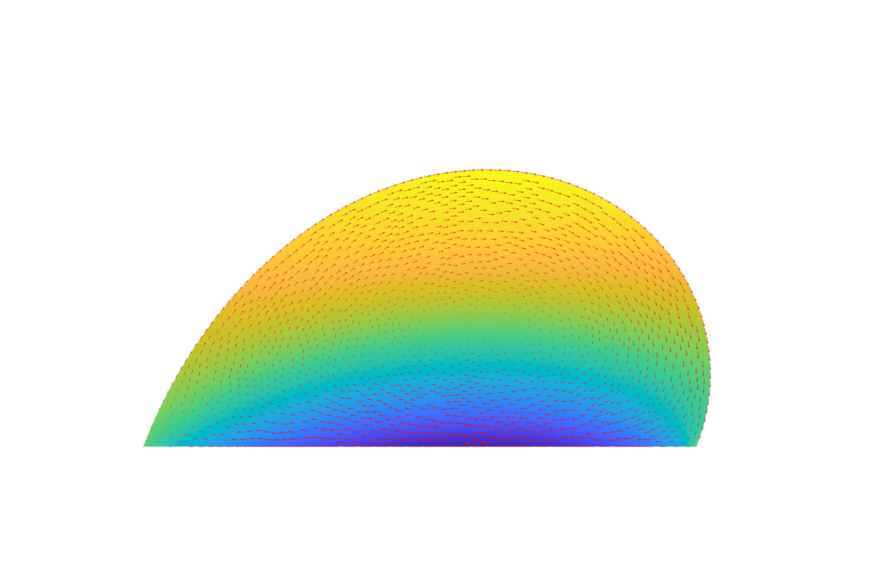

# MATLAB solves the Stokes free boundary problem

## Description
This repository contains a MATLAB code that solves a Stokes free boundary problem with dynamic contact angle using isoparametric finite elements in 2D. This packages provides a self-containted finite element framework using P2/P1 Taylor finite elements and P2 mapping of mesh description. A more detailed explanation of the model and its weak formulation as a saddle point problem for velocity $\mathbf{u}(t):\Omega\to\mathbb{R}^2$ and pressure $\mathbf{p}(t):\Omega\to\mathbb{R}$
$$
a(\mathbf{u},\mathbf{v}) - b(p,\mathbf{v})=f(\mathbf{v})
$$

$$
b(\mathbf{u},q)=0
$$
(for all test functions $\mathbf{v},q$), the time discretization and the motion of the moving domain $\Omega=\Omega(t)$ can be found, for example, in the paper

*Resolving the microscopic hydrodynamics at the moving contact line* 
by Amal K. Giri, Paolo Malgaretti, Dirk Peschka, Marcello Sega 
published in Physical Review Fluids (2022).

Basically, this software solves the following PDE problem:

Conservation of momentum and mass in $\Omega(t)$:

$$
-\nabla\cdot\boldsymbol{\sigma} = \boldsymbol{f}\quad\text{and}\quad \nabla\cdot\boldsymbol{u}=0
$$

Navier-slip on $\Gamma_{\mathrm{s}\ell}(t)$:

$$
\boldsymbol{t}\cdot\boldsymbol{\sigma}\boldsymbol{\nu}=-\mu_\Gamma\boldsymbol{t}\cdot\boldsymbol{u}
$$

Capillary forces on $\Gamma_{\ell}(t)$:

$$
\boldsymbol{\sigma}\boldsymbol{\nu}=\gamma\kappa\boldsymbol{\nu}
$$

Dynamic contact angle on $\Lambda(t)$:

$$
\mu_\Lambda\dot{\mathrm{x}}=f_\Lambda
$$

with the standard Cauchy stress $\boldsymbol{\sigma}=-p\mathbb{I}+\mu(\nabla\boldsymbol{u}+\nabla\boldsymbol{u}^\top)$, mean curvature $\kappa$ and outer normal vector field $\boldsymbol{\nu}$. Uncompensated Young stress is encoded in $f_\Lambda$ and dissipation parameters are $\mu,\mu_\Gamma,\mu_\Lambda$. Solutions are droplets as shown below, where these dissipation parameters impact bulk viscosity, Navier slip and contact line dissipation, respectively.

**Figure:** Typical solution of the free boundary problem, where the color shading shows the horizontal velocity $u_x$ and the red arrows show the flow field $\mathbf{u}=(u_x,u_z)$.

## Contents

The source code in contained in the directory `./src/` and organized in subfolders as follows

* `./dof` Contains functionality for management of degrees of freedom (dof): simple refinement, extraction of boundary, enumeration of vertices and edges etc.

* `./fem` Contains core finite element functionality, e.g., assembly of (local) sparse matrices, elements and quadrature, handling of transformation from reference to actual domain in 1D/2D.

* `./mesh` Sample meshes (generated using triangle)

* `./io` Contains functionality for input and output, e.g., reading and writing meshes and output to Paraview compatible vtk/vtu format.

The main folder contains the files 

* `problem_elliptic.m`, which solves a standard elliptic problem using isoparametric P2 elements on a disc 

* `stokes_FBP.m`, which solves the actual Stokes free boundary problem. For the Stokes free boundary problem, initialization of finite element matrices is moved to `fem_init.m`, a single time step of the Stokes flow problem is performed in `fem_solveflow.m`, and the mesh motion using ALE techniques is performed in `fem_ALE.m`. The latter three files are not to be called directly but are called from the main file `stokes_FBP.m`. 

The packages has no dependency on any nonstandard MATLAB packages and was tested with the version R2020a.

## Author

Dirk Peschka, WIAS Berlin, peschka@wias-berlin.de

If you find this software useful and want to use it, I would be happy about feedback. If you use it in the context of an own publication, please cite the paper

*Resolving the microscopic hydrodynamics at the moving contact line*, Amal K. Giri, Paolo Malgaretti, Dirk Peschka, Marcello Sega, Physical Review Fluids (2022).
